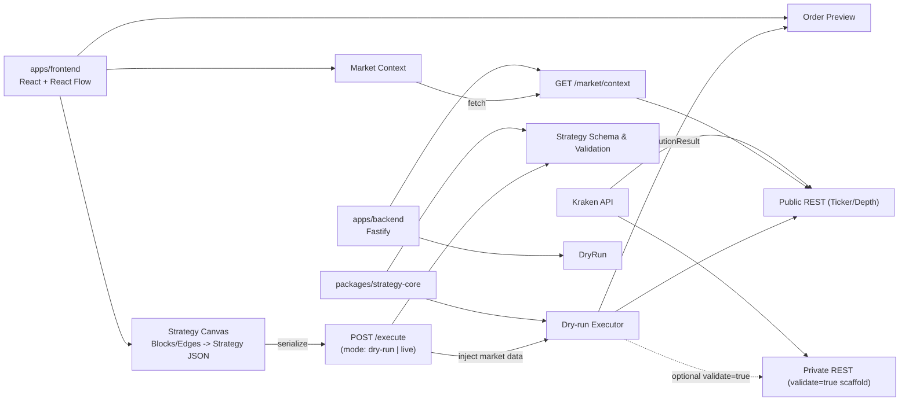

# Kraken DaD

Kraken DaD is a **Kraken-native, drag-and-drop strategy builder** that runs in **dry-run by default** with an **explicit live mode** for real orders. It pairs a React Flow UI with a Fastify backend and a shared TypeScript strategy core. The UI, blocks, and copy are aligned to Kraken Pro, and market data comes from Kraken’s public APIs.

## Demo assets
- Demo video: TODO (add link)
- Live prototype (optional): TODO (add link)

## What’s Included (quick tour)
- **Visual Strategy Canvas**: React Flow nodes/edges with type-safe handles (`control:*`, `data:*`), delete/selection support, one-start-node guard, and lane layout.
- **Strategy Core**: Shared schema + dry-run executor that validates the graph, orders control flow, executes block handlers, and returns structured execution results.
- **Kraken API integration**:
  - Public: `/0/public/Ticker` and `/0/public/Depth` fetched server-side, injected into strategy execution, and exposed via `GET /market/context`.
  - Private (live mode): HMAC signing for `AddOrder`/`CancelOrder` with optional validate-only checks; live trading is gated behind explicit opt-in + credential status.
- **Execution Feedback**: Preview with est. price/notional/fees, node status highlighting, and result summary.
- **Safety-first**: Dry-run enforced by default; private calls are gated and server-side; no credentials stored client-side.
- **Open source (MIT License)**: See `LICENSE`.

## Judge walkthrough
1) Open the app (blank canvas).
2) Use the empty-state CTA: **Add Strategy Start** or **Start with template** (drops Start → Market Data → Condition → Execution).
3) Optionally open **Strategy Blocks** and drag blocks to tweak.
4) Click **Execute workflow** (dry-run); see Order Preview and summary update.
5) Pan/zoom then press **Recenter** or **R** to fit the flow.
6) Export **Kraken Strategy Definition** (JSON).

## Judge checklist
- [ ] Demo video link works
- [ ] Kraken API usage is visible in README
- [ ] Dry-run vs live safety is clearly explained
- [ ] Reusability docs and strategy JSON example included
- [ ] Demo walkthrough steps match UI

## Features
- Blank-start canvas with empty-state CTA and one-click template.
- Kraken-themed palette with icons, search, tooltips, and scrollable groups.
- Mode pill with live/dry-run state + gated live toggle.
- Recenter control + keyboard shortcut (**R**) to refit the canvas.
- Live Market Context + Order Preview using Kraken data (fallback to mock with warning).
- Export strategy JSON; optional live mode with server-side credentials.

## Docs
- Reuse the strategy builder: `docs/strategy-builder-reuse.md`
- Strategy JSON example: `docs/strategy-json-example.md`
- Add a new block: `docs/add-block-guide.md`

## Architecture snapshot
- **apps/frontend**: React + React Flow, Kraken Pro styling, controls/rails/palette.
- **apps/backend**: Fastify API (`/execute`, `/execute/dry-run`, `/market/context`, `/kraken/credentials/*`, `/health`); live Kraken private orders when enabled.
- **packages/strategy-core**: Strategy schema + dry-run executor shared across UI/backend.
- **packages/kraken-client**: Typed Kraken REST helpers (public + private; validate or live).

Data flow: UI builds graph → serialize to strategy JSON → backend executes (dry-run or live) with Kraken market data → returns `ExecutionResult` → UI shows statuses/preview.



## Strategy blocks (current set)
- **Strategy Start** (Control): Kick off control lane.
- **Market Data** (Data): Live Kraken ticker snapshot.
- **Condition (IF)** (Logic): Branch on price rule (true/false).
- **Orderbook Guard** (Risk): Block on wide spreads.
- **Execution** (Action): Prepare Kraken order intent.
- **Order Control** (Action): Cancel intent by ID.
- **Audit Log** (Audit): Record audit trail.

## Controls & shortcuts
- **Recenter** button or press **R**.
- **Show/Hide Strategy Blocks** toggle; palette search + tooltips.
- **Show/Hide Context & Preview** toggle for more canvas space.

## Repository Layout
- `apps/frontend/` — Vite + React Flow UI (dark Kraken Pro styling), nodes, canvas, API clients, formatting utils.
- `apps/backend/` — Fastify server with `/execute`, `/execute/dry-run`, `/market/context`, `/kraken/credentials/*`, and `/health`.
- `packages/strategy-core/` — Strategy schema, dry-run executor, block definitions (Kraken ticker + order blocks).
- `packages/kraken-client/` — Typed Kraken REST helpers (public Ticker/Depth; private AddOrder/Cancel for validate or live).
- `docs/`, `tasks/` — Design notes and task trackers; `tasks/010-kraken-pro-ux.md` documents the current UX direction.

## Kraken API Usage
- **Public market data**: Backend fetches `/0/public/Ticker` and `/0/public/Depth` for strategy pairs, injects snapshots into `ExecutionContext.marketData`, and serves `GET /market/context` for the UI (Market Context dock + order preview). Dry-run execution now uses real Kraken prices where available (fallback to mock if unreachable).
- **Streaming path**: Kraken WS → backend SSE `GET /market/stream` → frontend `useMarketStream` hook for live ticker updates.
- **Private endpoints (safe by default)**: `packages/kraken-client` includes HMAC signing for `AddOrder`/`CancelOrder` with live order support gated by explicit UI opt-in. Credentials are stored server-side only (in-memory for runtime, or from env) and never returned to the frontend.
- **UI transparency**: Mode controls call out dry-run vs live execution and warn about real trades.

## Running Locally
Prereq: Node.js >= 18 (for native `fetch`).

Backend
```bash
cd apps/backend
npm install
npm run dev  # http://127.0.0.1:3001
```

Frontend
```bash
cd apps/frontend
npm install
npm run dev  # http://127.0.0.1:3000
```

Tests
```bash
npm install
npm test
```

Frontend API base URL
```bash
# defaults to http://127.0.0.1:3001 when unset
export VITE_API_BASE="http://localhost:3001"
```

Use the UI
- Start blank or load the template (empty-state CTA), or open Strategy Blocks to add nodes.
- Drag nodes (Strategy Start → Market Data → Condition → Risk → Execution), connect handles, and click **Execute workflow** (dry-run).
- Market Context + Order Preview use live Kraken data from the backend. If the API is unreachable, the UI falls back to a mock and shows a warning chip.
- Export the graph as **Kraken Strategy Definition** (JSON).

Mode & Safety
- Mode: Dry-run by default; live mode requires credentials + explicit toggle and warns before placing orders.
- Recenter: Use the **Recenter** button or press **R** to fit the canvas if you pan/zoom away.

## API Endpoints
- `GET /health` — simple health check.
- `GET /market/context?pair=BTC/USD` — Kraken Ticker + Depth snapshot (pair, lastPrice, bid/ask, spread, change24h).
- `GET /market/stream?pair=BTC/USD` — SSE stream backed by Kraken WS ticker feed.
- `POST /execute` — body `{ strategy: Strategy, mode?: 'dry-run' | 'live', validate?: boolean }`; returns `ExecutionResult`.
- `POST /execute/dry-run` — body `{ strategy: Strategy }`; backward-compatible dry-run execution.
- `GET /kraken/credentials/status` — credential status flag (configured + source).
- `POST /kraken/credentials` — store Kraken API key/secret (server-side only).
- `DELETE /kraken/credentials` — clear runtime credentials.

## Configuration (Optional Live Mode)
You can either submit credentials via the UI (stored in-memory on the backend for the current session), or set env vars in `apps/backend` for a persistent setup:
```
KRAKEN_API_KEY=...
KRAKEN_API_SECRET=...
```
Live mode only runs when explicitly enabled in the UI; dry-run remains the default behavior.

## Safety & Constraints
- Live trading is **opt-in**; dry-run is enforced unless the user explicitly enables live mode.
- Private API usage is server-side only; credentials are never sent back to the frontend.
- CORS is open for local demo; lock down in production.

## Known limitations / future work
- Backend dry-run may use mock data if Kraken public API is unreachable.
- Live mode uses in-memory credential storage only; add encrypted persistence for production.
- Block catalog is minimal; more Kraken-native blocks (OHLC signals, spread guards) can be added in `strategy-core`.
- No persistence of user-created strategies across sessions (out of scope for hackathon).

## Submission & Licensing
- License: **MIT** (see `LICENSE`).
- Deliverables: GitHub repo, working prototype, demo video, README (this file) explaining architecture and Kraken integration.
- Demo video: include a short walkthrough (empty state → add blocks/template → execute dry-run → recenter).

## Submission checklist (hackathon)
- [ ] README updated (this file) with Quickstart, architecture, safety, and usage.
- [ ] MIT license present.
- [ ] Demo video link added.
- [ ] Live prototype URL added (optional).
- [ ] Prototype runs locally (frontend + backend) with dry-run flow.
- [ ] Strategy JSON export works.

## Next Steps (if extending)
- Add more Kraken-native blocks (orderbook guard, OHLC-derived signals, spread guards) using the shared `kraken-client`.
